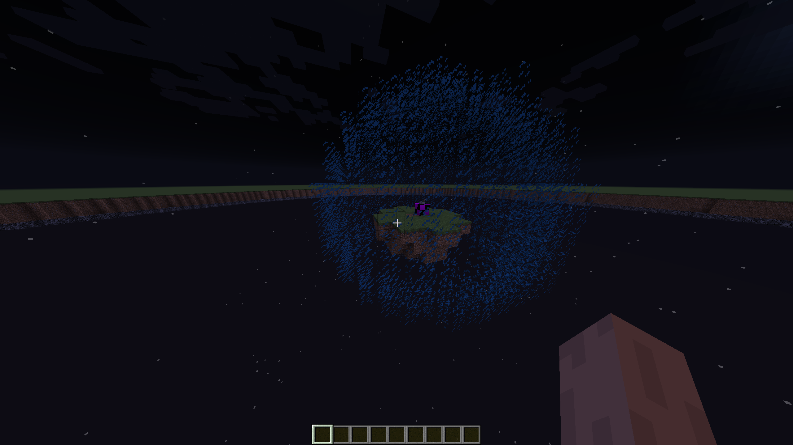
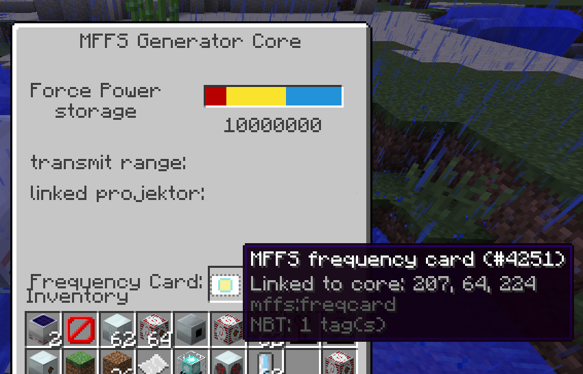

# Modular Force-Field System for IC2-Classic!

This is my MFFS rewrite for **1.12.2**, based on the work by Thunderdark and immibis.

Textures are taken from the original mod, whilst the code is a ground-up rewrite in Kotlin. For specific numbers, I've
used the original mod as a reference, with the goal of being as faithful as possible to the mod as it was in
[Tekkit Classic](https://www.technicpack.net/modpack/tekkit.552560). MFFS included its source code in the mod's JAR, 
which made this a substantially easier process :)

**Working force-field!:**

**Force-Field Core's GUI, plus linking cards:**

## Issues/Notes

Below is a non-exhaustive list of current issues and missing functionality: 

- Fields act as though they've got the Block Cutter upgrade all the time!
- Projectors cannot connect to cores and have infinite power.
- Projectors are only ever spheres.
- Projectors don't have a GUI.
- Projectors have no texture. 

## Why???

The main motivation for doing so was the release of [Tekkit 2](https://www.technicpack.net/modpack/tekkit-2.1935271)(!!).

Notably, apparently since I last worked on this,
Tekkit 2 now actually has an [MFFS mod](https://github.com/ACGaming/modularforcefieldsystem/tree/1.12), which on initial
glance looks to be based on the fork that used Universal Electricity back when that existed. Whilst I have no doubt
that's an excellent mod, being based off the newer UE-centric path of MFFS doesn't meet my wants personally for the
nostalgia-factor.

Given it's under the Lesser GPL, I may use it as reference for the force-field implementation going forward, given my
lack of Forge experience :P

---

I originally worked on this project in 2023 due to the reasons explained above, but lost the motivation to work on it as
there wasn't time for the project, and I had used up much of my energy on issues getting Gradle, ForgeGradle, and simply
Forge, to behave themselves - Forge in 1.12.2 generally hates the idea of functioning correctly, and its team has a
strict policy on dropping support for old versions, so that's nice.
